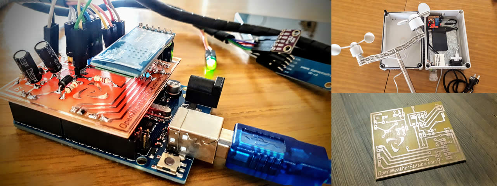
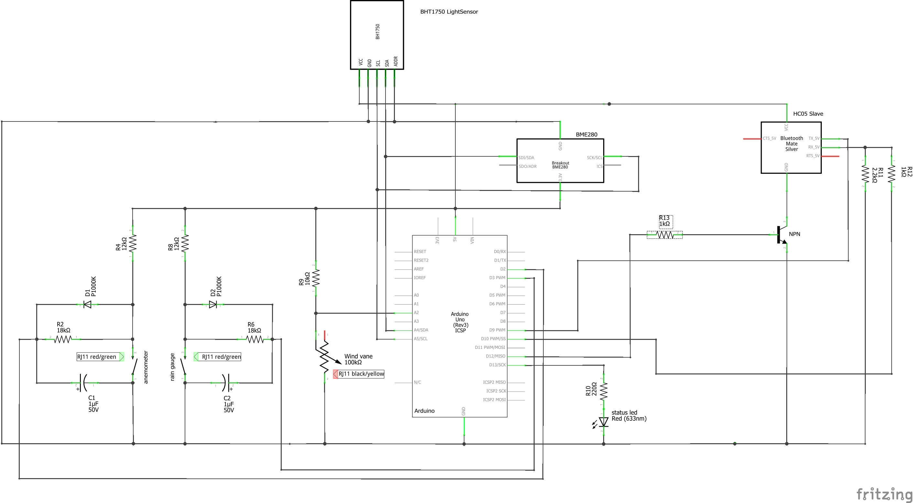
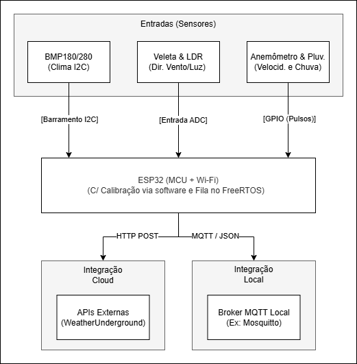

# Open Weather Station

## Integrantes

| Nome                                           | Matrícula |
| ---------------------------------------------- | --------- |
| [Laís Soares](https://github.com/Laisczt)      | 211029512 |
| [Bruna Lima](https://github.com/libruna)       | 211041105 |
| [José Augusto](https://github.com/JAugustoM)   | 231026429 |
| [Ana Catarina](https://github.com/an4catarina) | 211041099 |

## 1) Descrição do produto

Open Weather Station (OWS) é uma solução de monitoramento de fatores climáticos (e.g. velocidade do vendo, termperatura, precipitação, etc.) utilizando um arduíno e um dispositivo móvel, criada com o intuito de ser mais barata, compacta, e amigável ao usuário que outras opções existentes no mercado. OWS é capaz de enviar telemetria sem fio ao servidor local ou integrar diretamente à serviços como Wunderground, Thingspeak, Windguru ou OpenWeatherMap.

_Figura 1: Open Weather Station. Fonte: Francisco Clariá (2024)_

### 1.1) Funções principais, público-alvo e contexto de uso

| Funcionalidade                    | Descrição                                                                                                      |
| --------------------------------- | -------------------------------------------------------------------------------------------------------------- |
| Comunicação sem fio               | O OWS é capaz de transmitir suas informações por meio de wi-fi ou rede móvel 4G, a partir do dispositivo móvel |
| Visualização de dados/diagnóstico | O aplicativo móvel permite a visualização dos dados em gráficos, e o diagnóstico do sistema arduino            |
| Integração com mapas abertos      | O formato de dados gerados é compatível com Wunderground, Thingspeak, Windguru e OpenWeatherMap                |

**Informações coletadas**

- Velocidade do vento(m/s)
- Direção do vento (ângulo)
- Rajada de vento (m/s)
- Direção da rajada de vento (ângulo)
- Chuva(mm)
- Temperatura(ºC)
- Pressão atmosférica(Pascal)
- Humidade relativa(%)
- Iluminação Ambiente(lux)

### 1.2) Componentes e sensores utilizados

Abaixo está a lista dos principais componentes e sensores utilizados na OWS, o BoM completo do projeto - incluindo fios, capacitores e componentes estruturais - pode ser visto neste [link](https://github.com/panchazo/open-weather-station#list-of-materials)

| Componente            | Quantidade | Uso                                                                         |
| :-------------------- | :--------: | :-------------------------------------------------------------------------- |
| Sensor BH1750         |     1      | Utilizado para medir a iluminição ambiente                                  |
| Sensor BME280         |     1      | Utilizado para medir a temperatura, pressão atmosférica e humidade ambiente |
| Anemômetro WS 1080    |     1      | Utilizado para medir a velocidade do vento                                  |
| Veleta WS 1080        |     1      | Utilizado para medir a direção do vento                                     |
| Pluviômetro WS 1080   |     1      | Utilizado para medir o volume de chuva                                      |
| Arduino Uno R3        |     1      | Microcontrolador utilizado como unidade de processamento                    |
| Módulo Bluetooth HC05 |     1      | Provê conectividade bluetooth ao dispositivo                                |

Abaixo está o esquemático completo do sistema:

_Figura 2: Esquemático da OWS. Fonte: Francisco Clariá (2024)_

### 1.3) Tecnologias de comunicação e controle embarcadas

A comunicação com os sensores BH1705 e BME280 é feita utilizando comunicação I2C no mesmo barramento. O pluviômetro, a veleta e o anemômetro utilizam comunicação serial via conector RJ11.

O envio de informações do sistema para o aplicativo é feita via bluetooth, utilizando o módulo HC05.

## 2) Análise técnica do funcionamento

### 2.1) Principais módulos do sistema

O sistema original da OpenWeatherStation foi projetado em torno de componentes de fácil acesso e focava na comunicação local via Bluetooth. Ele é dividido nos seguintes módulos principais:

1. **Módulo de Processamento Central**: Responsável por ler os sensores e formatar os dados. No projeto original, isso é feito utilizando um Arduino Uno.
2. **Módulo de Sensoriamento Atmosférico**: Composto pelo sensor BME280 (para medição de temperatura, umidade e pressão) e pelo sensor BH1750 (para medição da luminosidade), ambos comunicando-se via barramento I2C.
3. **Módulo de Sensoriamento Eólico e Pluviométrico**: Utiliza as peças mecânicas de reposição da estação comercial WS1080, lendo os contatos magnéticos (reed switches) do anemômetro (velocidade do vento) e pluviômetro (chuva), além dos resistores da biruta (direção do vento).
4. **Módulo de Comunicação Local**: Baseado no módulo Bluetooth HC05, que transmite os dados lidos pelo microcontrolador para um dispositivo próximo.
5. **Módulo de Interface e Armazenamento (App Android)**: Um aplicativo de smartphone que pareava com a estação via Bluetooth para coletar, exibir e armazenar os dados climáticos.

### 2.2) Identificação de tecnologias críticas

Para o funcionamento adequado da versão original da **OpenWeatherStation**, as seguintes tecnologias e conceitos de hardware/software são considerados críticos para a arquitetura do projeto:

- **Comunicação Serial sem Fio (Bluetooth):** No projeto original, a estação meteorológica não possui uma tela para mostrar os dados ou conexão com a Internet. O módulo HC05, operando através do _Serial Port Profile (SPP)_, atua como a única ponte de saída de dados. Sem esta tecnologia, a estação estaria limitada a recolher os dados localmente, sem a capacidade de envia-los ao celular para serem exibidas.

- **Barramento I2C:** É o protocolo de comunicação que viabiliza a leitura dos sensores digitais do projeto (BME280 para métricas atmosféricas e BH1750 para luminosidade). O I2C é considerado crítico porque permite interligar múltiplos sensores de alta precisão utilizando apenas dois pinos do microcontrolador (SDA e SCL), preservando as demais portas digitais e analógicas para outras aplicações.

- **Interrupções de Hardware:** O anemómetro (velocidade do vento) e o pluviómetro (volume de chuva) geram pulsos digitais rápidos a cada fecho dos seus contactos magnéticos. Se o microcontrolador tentasse ler estes pulsos através de _polling_, poderia perder contagens importantes durante rajadas de vento ou precipitação intensa.

- **Conversão Analógico-Digital (ADC) e Divisores de Tensão:** A biruta (direção do vento) do kit original funciona como um divisor de tensão variável, onde diferentes posições ativam diferentes resistores internos gerando variações de voltagem. A capacidade do microcontrolador de ler este sinal analógico de forma precisa através do seu conversor ADC, mapeando a tensão para um valor numérico, é a tecnologia crítica que permite descodificar a origem direcional do vento.

- **Tratamento de _Debounce_:** Os sensores baseados _reed switches_ sofrem do fenómeno de _bouncing_, que o microcontrolador pode interpretar como múltiplos acionamentos simultâneos. A implementação de filtros de _debounce_ é crítica para realizar medições precisas de volume de chuva e velocidade do vento.

- **Aplicação Mobile Datalogger:** Uma vez que as placas baseadas na arquitetura Arduino clássica (como o Uno ou Nano) possuem uma memória extremamente limitada para guardar o histórico climático, o projeto original delega as funções de armazenamento de dados, relógio de tempo real (RTC) e interface gráfica para uma aplicação Android. O desenvolvimento desta aplicação é uma tecnologia crítica, pois atua como a unidade de processamento de alto nível do sistema, recebendo as _strings_ de dados brutos via Bluetooth, processando-as e exibindo-as no aplicativo mobile.

## 3) Proposta de reprodução com ESP32

### 3.1) Descrição conceitual de como as funcionalidades poderiam ser implementadas usando a ESP32 e componentes compatíveis com o ecossistema ESP-IDF;

A reprodução do sistema substituirá a arquitetura original baseada em Arduino/Bluetooth por uma solução baseada no ESP32, utilizando os sensores disponíveis.
Sem a necessidade de uma interface visual local, o ESP32 operará como um módulo de sensoriamento, enviando dados diretamente para a rede.

- **Leitura I2C (Atmosfera)**: Utilizando a API `driver/i2c.h` do ESP-IDF, o sistema configurará o ESP32 como mestre I2C para ler o sensor BMP180 ou BMP280. Uma Task do FreeRTOS será responsável por buscar essas leituras em intervalos regulares.
- **Leitura Analógica (Luminosidade e Direção do Vento)**: O ADC do ESP32, configurado via `esp_adc/adc_oneshot.h`, será usado para ler os valores de tensão. Um pino será conectado ao sensor LDR configurado em um divisor de tensão para estimar a luz solar.
- **Comunicação IoT (Wi-Fi, HTTP ou MQTT):**: Será utilizada a conectividade Wi-Fi nativa da ESP32 via `esp_wifi.h`. O processamento de dados consolidará as variáveis climáticas e o sistema poderá ser configurado para duas abordagens de envio:
  1. **Integração em Nuvem (HTTP)**: Usando a biblioteca `esp_http_client.h`, o ESP32 montará as requisições POST formatadas de acordo com a API do WeatherUnderground, permitindo que os dados da estação sejam visíveis na plataforma.
  2. **Integração Local (MQTT)**: Usando a biblioteca nativa `mqtt_client.h`, o ESP32 empacotará os dados em uma string no formato JSON e publicará em um tópico de um broker MQTT local.

### 3.2) Diagrama conceitual do sistema

_Figura 3: Diagrama de blocos da reprodução da OWS com ESP32._

### 3.3) Limitações e desafios esperados

- **Falta de Medição de Umidade Relativa**: A restrição aos sensores da lista implica a ausência de um sensor capaz de medir a umidade relativa do ar (como os comumente usados DHT11 ou BME280 completo), limitando os dados providos pela estação.
- **Dependência de Wi-Fi**: Como a estação enviará dados via HTTP para o WeatherUnderground ou via MQTT localmente, e não possui um display próprio para apresentar os dados, qualquer instabilidade na rede local irá impedir o envio das informações. Será necessário implementar no código uma lógica de reconexão robusta e, possivelmente, uma fila no FreeRTOS para não perder dados durante quedas curtas.
- **Não Linearidade e Ruído no ADC**: A estimativa de luminosidade via LDR pode ser prejudicada pela não-linearidade do ADC do ESP32. O desafio será implementar curvas de calibração via software ou utilizar as APIs de calibração (`esp_adc_cal.h`) para amenizar esta limitação.

## 4) Pesquisa bibliográfica e tecnológica

### 4.1) Artigos sobre tecnologia do produto

#### Artigo 1: Comparative Analysis of Power Consumption between MQTT and HTTP Protocols in an IoT Platform Designed and Implemented for Remote Real-Time Monitoring of Long-Term Cold Chain Transport Operations

- **Autores:** Heriberto J. Jara Ochoa, Raul Peña, Yoel Ledo Mezquita, Enrique Gonzalez, Sergio Camacho-Leon
- **DOI e Acesso:** [10.3390/s23104896](https://www.mdpi.com/1424-8220/23/10/4896)

- **Resumo:** O artigo apresenta uma análise comparativa entre os protocolos MQTT e HTTP em uma plataforma IoT destinada ao monitoramento remoto em tempo real no setor de transportes. Os autores desenvolveram e validaram um sistema embarcado baseado em NodeMCU para avaliar o impacto dos protocolos no consumo energético, considerando diferentes níveis de QoS do MQTT. Os resultados demonstraram que o MQTT apresentou maior eficiência energética, proporcionando uma economia de 6,03% com QoS 0 e 8,33% com QoS 1 em relação ao HTTP, o que contribui para o aumento da autonomia de dispositivos alimentados por bateria. Este trabalho foi selecionado porque analisa exatamente as duas abordagens de conectividade propostas para a nossa ESP32: a integração em nuvem com requisições POST via HTTP e a publicação em rede local via MQTT.

#### Artigo 2: A Programmable Plug & Play Sensor Interface for WSN Applications

- **Autores:** Cornetta, G.,  Fatimi, S.,  Kochaji, A.,  Moussa, O.,  Almaleky, M.S., Lamrini, M. e Touhafi, A.
- **DOI e Acesso:** [10.3390/hardware3040013](https://doi.org/10.3390/hardware3040013)

- **Resumo:** O artigo descreve um módulo de hardware e interface programável projetado para converter as leituras analógicas puras de sensores de baixo custo em um formato digital legível por microcontroladores de rede. O sistema foca em tratar diferentes faixas de tensão na saída dos sensores através de ajustes de ganho, criando compatibilidade elétrica direta com as portas lógicas da unidade de controle. Este trabalho foi selecionado porque fornece um embasamento científico direto para a tecnologia dos conversores analógico-digitais (ADC) e divisores de tensão. Essa tecnologia é crítica para a Open Weather Station, pois é o que permite mapear sinais de variação de voltagem (como os gerados pela veleta de direção do vento e pelo sensor de luminosidade) em valores numéricos que podem ser decodificados e processados pela ESP32.

#### Artigo 3: ESP32-Based Unified IoT Platform for Weather and Air Quality Monitoring with LoRa and MQTT

* **Autores:** Adedeji, K. B., & Ponnle, A. A.

* **DOI e Acesso:** [10.3390/s24092729](https://www.mdpi.com/1424-8220/24/9/2729).

* **Resumo:** O artigo apresenta uma plataforma IoT para monitoramento meteorológico e da qualidade do ar utilizando dispositivos da família ESP e protocolos de comunicação como MQTT. A arquitetura integra ferramentas para armazenamento, processamento e visualização dos dados, além de mecanismos para aumentar a confiabilidade da transmissão das informações coletadas. Este trabalho foi selecionado por fornecer embasamento para o uso de comunicação IoT na Open Weather Station, especialmente na integração da ESP32 com protocolos como HTTP e MQTT.

#### Artigo 4: Development of ICT for Leaching Monitoring in Taiwan Agricultural LTER Stations

- **Autores:** Chan Y, Hu J, Chou C, Liao C e Chen C
- **DOI e Acesso:** [10.3390/environments4030047](https://www.mdpi.com/2076-3298/4/3/47)

- **Resumo:** O artigo acompanha o desenvolvimento de um sistema de monitoramento de lixiviação agrícola no Taiwan, uma operação que ocorre desde 2008 e, inicialmente, necessitava que trabalhadores coletassem manualmente os dados de sensores em campo duas vezes ao mês. Essa abordagem era cara, a manutenção dos sensores era ineficiente, e monitoramento em tempo real era impossível. Eventualmente, 3 versões de sistemas ICT foram desenvolvidos que abordam esses problemas, porém cada uma sofria de detrimentos causados pelas tecnologias específicas escolhidas. Finalmente, a quarta versão foi desenvolvida utilizando uma plataforma arduino, RF 2.4GHz rede móvel 4G. Esta versão ostenta menor custo, consumo de energia e maior expansibilidade que suas predecessoras.

### 4.2) Artigos sobre a aplicação / uso do produto

#### Artigo 1: New Model for Weather Stations Integrated to Intelligent Meteorological Forecasts in Brasília

- **Autores:** Thomas Alexandre da Silva, Andre L. M. Serrano, Erick R. C. Figueiredo, Geraldo P. Rocha Filho, Fábio L. L. de Mendonça, Rodolfo I. Meneguette 3 and Vinícius P. Gonçalves
- **DOI e Acesso:** [10.3390/s25113432](https://www.mdpi.com/1424-8220/25/11/3432)

- **Resumo:** O artigo apresenta o desenvolvimento de uma estação meteorológica automática de baixo custo baseada em um sistema embarcado alimentado por energia solar. A solução utiliza um microcontrolador integrado a diversos sensores ambientais para monitorar variáveis como temperatura, umidade, radiação ultravioleta, precipitação e qualidade do ar. Os dados coletados são processados e transmitidos em tempo real por meio de conexão Wi-Fi para uma plataforma Web, onde são armazenados e utilizados por um modelo de aprendizado de máquina capaz de gerar previsões meteorológicas para as próximas 24 horas. Os resultados demonstraram elevada estabilidade operacional, autonomia energética e boa concordância com os dados de estações meteorológicas oficiais. Como aplicação em sistemas embarcados, o trabalho evidencia a utilização de hardware de baixo custo, comunicação sem fio, sensoriamento distribuído e processamento inteligente de dados para monitoramento ambiental.

#### Artigo 2: Sustainable agriculture from the bottom up: a compact and versatile low-cost platform for agricultural monitoring

- **Autores**: Kretzschmar M, Dubbert M, Lück M, Asante M, Sossa G e Hoffmann M
- **DOI e Acesso:** [10.3389/fagro.2026.1768276](https://www.frontiersin.org/journals/agronomy/articles/10.3389/fagro.2026.1768276/full)

- **Resumo:** O artigo apresenta uma análise da viabilidade do uso de estações meteorológicas DIY de baixa custo como alternativa para estações profissionais de alto custo.
  O artigo utiliza uma solução própria, a *Environmental Variables Explorer* (EVE), baseada no uso de um microcontrolador ESP32. A EVE é capaz de coletar informações sobre 
  radiação solar, temperatura do ar, umidade relativa e pressão do ar, e é capaz de operar de forma offline, armazenando os dados na memória FRAM interna, ou online via conexão
  Wi-Fi a um dashboard que pode ser executado localmente pelo usuário. Os resultados do artigo demonstraram que a solução implementada pelos pesquisadores alcançou altos níveis
  de precisão em condições ideais, também foi demonstrado que a solução possui uma confiabilidade satisfatória em relação a estabilidade das coletas de dados e ao manejo dos 
  dados coletados.

#### Artigo 3: **Real-Time Air Quality and Weather Monitoring System Utilizing IoT for Sustainable Urban Development and Environmental Management**

* **Autores:** Akash Ram Kondeti, Leelavathi Rudraksha, Silpa Chinnaiahgari e Anitha Bujunuru

* **DOI e Acesso:** [10.3390/ECSA-12-26599](https://www.mdpi.com/2673-4591/118/1/56)

* **Resumo:** O artigo descreve um sistema portátil de monitoramento ambiental baseado em ESP32 que coleta dados como temperatura, umidade, qualidade do ar e luminosidade e os envia via Wi-Fi para plataformas em nuvem. A solução também permite o acompanhamento remoto das medições em tempo real por meio de uma aplicação móvel. Este trabalho foi selecionado por apresentar uma aplicação semelhante à proposta da Open Weather Station, demonstrando o uso de sensores ambientais, comunicação sem fio e integração com serviços em nuvem.

#### Artigo 4: Contribution of personal weather stations to the observation of deep-convection features near the ground

- **Autores:** Mandement M e Caumont O
- **DOI e Acesso:** [10.5194/nhess-20-299-2020](https://doi.org/10.5194/nhess-20-299-2020)

- **Resumo:** O artigo avalia a contribuição de PWSs à observação de convecção profunda na atmosfera - um fenômeno difícil de se medir devido a esparcidade de sensores próximos ao solo. Entra os PWSs, que apesar de sofrer com qualidade de medições reduzidas em comparação a aparelhos meteorológicos de pesquisa, oferecem uma densidade de medições muito desejada. As razões responsáveis por essa qualidade inferior incluem: exposição ao sol ou fontes de calor, condições do solo, ventilação, falta de manutenção e calibração. Os autores apresentam sua avaliação na forma de estudos de caso: 4 tempestades/grupos de tempestades sobre a frança cujos sinais de formação foram detectados por redes de PWSs muito antes de aparecerem em aparelhos de estações meteorológicas. O artigo ressalta, porém, que os dados brutos de PWSs devem ser processados e refinados antes que possam ser integrados aos dados de estações meteorológicas.

## 5) Comparativo com produtos similares

| Produto | Objetivo | Sensores principais | Comunicação | Alimentação | Diferencial | Preço Médio (USD) |
| :--- | :--- | :--- | :--- | :--- | :--- | :---: |
| **Open Weather Station** | Medir, monitorar, armazenar dados e enviá-los para servidores próprios ou redes meteorológicas | Temperatura, Umidade, Pressão, Luminosidade, Pluviometria, Anemometria | Bluetooth + Wi-Fi | USB (Power Bank) + suporte a painel solar | Hardware e software open source, totalmente personalizáveis | ~400 |
| **Ambient Weather WS-2902** | Fornecer um pacote residencial completo que capta os dados externos e os publica automaticamente em redes meteorológicas e assistentes virtuais | Temperatura, Umidade, Pressão, Chuva, Vento, Radiação Solar, Índice UV | RF + Wi-Fi | Painel solar + pilhas AA | Sistema de baixo custo pronto para uso | ~199 |
| **Davis Vantage Pro2 (6252/6252M)** | Assegurar medições ininterruptas com precisão e alta resistência física para pesquisas, agricultura e uso profissional | Temperatura, Umidade, Pressão, Chuva, Vento | Rádio FHSS + WeatherLink Console | Painel solar + bateria CR123A | Precisão profissional, alta durabilidade e  calibração de nível laboratorial | ~1.035 |
| **Ecowitt GW1101** | Coletar dados de sensores modulares e entregar o controle da rede ao usuário, facilitando o envio direto das informações para servidores HTTP locais | Temperatura, Umidade, Pressão, Chuva, Vento, Radiação Solar, Índice UV | RF + Wi-Fi (via gateway) | Painel solar + 2 pilhas AA + USB | Arquitetura modular com suporte a servidor HTTP personalizado | ~179 |
| **Netatmo Smart Weather Station** | Avaliar as condições climáticas externas e a qualidade do ar interno para acionar rotinas de automação em ecossistemas de casas inteligentes | Temperatura, Umidade, Pressão, CO2, Ruído | Wi-Fi nativo | USB + pilhas AAA | Integração com ecossistemas de casa inteligente | ~149 |
| **Tempest Weather Station** | Fornecer uma estação residencial de alta tecnologia e manutenção física zero, voltada para integração com sistemas de casa inteligente e redes meteorológicas | Temperatura, Umidade, Pressão, Vento, Chuva, Índice UV, Iluminância, Raios | RF + Wi-Fi | 4 painéis solares + bateria LTO integrada | Sensores de estado sólido (ultrassônicos e hápticos), sem peças móveis | ~349 |

### Análise Comparativa

A Open Weather Station diferencia-se por sua arquitetura open source e pelo baixo custo de implementação. Suas principais vantagens incluem a flexibilidade na personalização do projeto, a facilidade de reparo com componentes comuns e o controle dos dados, livre de serviços proprietários em nuvem.

Em contraste, as opções comerciais atendem a públicos específicos, possuem custos maiores e funcionam de forma mais restrita:

- **Ambient Weather WS-2902:** Oferece uma solução tradicional de bom custo-benefício para uso residencial. É um equipamento fácil de instalar, mas vincula o acesso aos dados aos servidores da própria marca.

- **Davis Vantage Pro2:** É a opção voltada para uso profissional. Destaca-se pela alta precisão das medidas e pela resistência mecânica para suportar climas adversos ao longo dos anos.

- **Ecowitt GW1101:** Apresenta um formato flexível. Permite montar a estação por etapas e facilita o envio das informações climáticas direto para o computador local do usuário, sem a necessidade de nuvens externas.

- **Netatmo Smart Home Weather Station:** Foca no design e na integração com casas inteligentes. Seu diferencial é incluir sensores para o ambiente interno, com leitura de CO2 e ruído, porém restringe o usuário aos aplicativos da própria marca.

- **Tempest Weather Station:** Não possui peças móveis, como hélices. Utiliza tecnologias como o ultrassom para verificar o clima, o que evita desgastes físicos ou falhas mecânicas.

## 6) Referências bibliográficas

[1] AMBIENT WEATHER. **Ambient Weather WS-2902 Home**. Disponível em: https://ambientweather.com/ws-2902-smart-weather-station. Acesso em: 29 jun. 2026.

[2] CLARIÁ, Francisco. **Open Weather Station**. Disponível em: https://github.com/panchazo/open-weather-station. Acesso em: 28 jun. 2026

[3] CHAN, Yankuang et al. **Development of ICT for Leaching Monitoring in Taiwan Agricultural LTER Stations**. Taiwan Agriculture Research Institute. Taichung, Taiwan. 30 jun. 2027. doi: https://doi.org/10.3390/environments4030047.

[4] CORNETTA, Giancula et al. **An Open-Source Educational Platform for Multi-Sensor Environmental Monitoring Applications**. Universidad CEU San Pablo. Madrid, Espanha. 15 out. 2025. doi: https://doi.org/10.3390/hardware3040013.

[5] DA SILVA, Thomas Alexandre et al. **New Model for Weather Stations Integrated to Intelligent Meteorological Forecasts in Brasilia**. Universidade de Brasília. Brasília, Brasil. 29 maio 2025. doi: https://doi.org/10.3390/s25113432.

[6] DAVIS INSTRUMENTS. **Wireless Vantage Pro2 Weather Station**. Disponível em: https://www.davisinstruments.com/products/wireless-vantage-pro2-weather-station-with-standard-radiation-shield-and-weatherlink-console. Acesso em: 29 jun. 2026.

[7] ECOWITT. **GW1101**. Disponível em: https://www.ecowitt.com/shop/goodsDetail/244. Acesso em: 29 jun. 2026.

[8] KAIRUZ-CABRERA, David et al. **Development of a Unified IoT Platform for Assessing Meteorological and Air Quality Data in a Tropical Environment**. Universidad Central "Marta Abreu" de Las Villas. Santa Clara, Cuba. 25 abril 2024. doi: https://doi.org/10.3390/s24092729.

[9] KONDETI, A; RUDRAKSHA, L; CHINNAIAHGARI, S; BUJUNURU, A. **Real-Time Air Quality and Weather Monitoring System Utilizing IoT for Sustainable Urban Development and Environmental Management**. Vasavi College of Engineering. Hydebarad, India. 7 nov. 2025. doi: https://doi.org/10.3390/ECSA-12-26599

[10] KRETZSCHMAR, Milan et al. **Sustainable agriculture from the bottom up: a compact and versatile low-cost platform for agricultural monitoring**. Leibniz Center for Agricultural and Landscape Research (ZALF). Müncheberg, Alemanha. 14 abril 2026. doi: https://doi.org/10.3389/fagro.2026.1768276

[11] MANDEMENT, Marc; CAUMONT, Olivier. **Contribution of personal weather stations to the observation of deep-convection features near the ground**. Natural Hazards and Earth System Sciences, v 20, p 299–322. 24 jan. 2020. doi: https://doi.org/10.5194/nhess-20-299-2020

[12] NETATMO. **Smart Home Weather Station**. Disponível em: https://www.netatmo.com/smart-weather-station. Acesso em: 29 jun. 2026.

[13] OCHOA, H. et al. **Comparative Analysis of Power Consumption between MQTT and HTTP Protocols in an IoT Platform Designed and Implemented for Remote Real-Time Monitoring of Long-Term Cold Chain Transport Operations**. Tecnologico de Monterrey. Monterrey, México. 19 maio 2023. doi: https://doi.org/10.3390/s23104896.

[14] TEMPEST. **Tempest Weather Station**. Disponível em: https://shop.tempest.earth/products/tempest. Acesso em: 29 jun. 2026.
